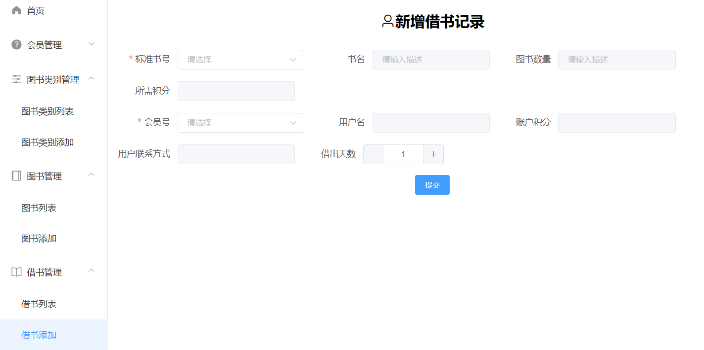

 **基于SpringBoot+Vue 的图书管理系统** 

###功能模块

1、系统登录

    管理员系统登录

2、管理员设置

    添加账户、修改账户、查询账户、重置密码、账号账号、删除账号

3、会员管理

    添加会员、修改会员、删除会员、查询会员、会员积分充值、账号禁用

4、图书类别管理

    添加图书类别、修改图书类别、删除图书类别、查询图书类别

5、图书管理

    添加图书、修改图书、删除图书、查询图书

6、借书管理

    添加借书记录、查询借书记录、删除借书记录

7、还书管理

    归还图书、提醒还书日期、未及时归还扣除多余的会员积分


### 效果展示

登录页面


首页


管理员列表

管理员添加（密码为默认）


会员列表


会员添加

图书类别列表（设有二级目录）


图书类别添加 


图书列表


图书添加


借书列表（点击还书进行还书操作）


添加借书记录（根据图书编号、会员号借书）


还书列表


1. 关注陆小马公众号获取sql文件，创建数据库，运行sql，或者联系我远程部署调试
   sql：https://mbd.pub/o/bread/ZpiUlJtx
2. idea打开项目，修改数据库用户名密码
3. vue 前端v16.20.2
# vue

## Project setup
```
npm install
```

### Compiles and hot-reloads for development
```
npm run serve
```

### Compiles and minifies for production
```
npm run build
```

### Customize configuration
See [Configuration Reference](https://cli.vuejs.org/config/).

4. 联系:定制开发各种软件系统网站app等等

   

   定制python、java、c、c++、app、html、计算机相关作业、软件网站代写指导帮忙、电脑提速优化 请私信公号中提醒联系协商时间等

   如有需要请提前准备远程连接软件 ToDesk官网下载或网盘下载ToDesk_4.7.2.1

   链接：https://pan.baidu.com/s/1AkZ8DGP5dbDeU7naH6v7Gw?pwd=1024
   提取码：1024

   开发环境 JDK1.8 or 11 IntelliJ IDEA Maven tomcat Node.js -v16.20.2 Redis MySQL 5.7or8 微信开发者工具 AndroidStudio navcat

   资源获取渠道说明：

   百度搜blotemj不迷路

   公号众、b站：陆小马

   CSDN博客：https://blotemj.blog.csdn.net/

   面包多：https://mbd.pub/o/blotemj

   更新一些资料，录一些相关视频均在以上平台发布敬请期待。。。